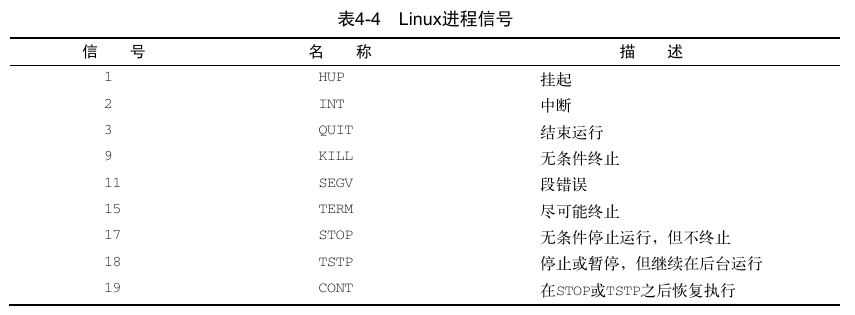

# SHELL脚本编程大全note

## Char3 基本的bash shell命令

### man

`man`可以查看手册，使用方法是`man #section topic`其中`#section`是内容区域，默认为1，不同内容存放不同领域内容，在每个区域内又会分很多小节，对应不同标题。

小节和内容区域的具体定义可以用`man man`查询到。

### ls

#### 常见选项

`ls -F`可以让列出来的文件夹后多`/`，且可执行文件前多`*`

`ls -a`可以列出`.`开头的隐藏文件

`ls -R`会递归地列出所有目录下内容

`ls -l`会列出完成文件信息

多个选项可以合并组合，如`ls -F -R`可以写成`ls -FR`

#### 过滤输出列表

就是加一个参数指定`ls`的文件或目录

该参数可以使用准确名称，也可以使用文件拓展匹配(file globbing)

使用元字符通配符(metacharacter wildcards)可以实现文件拓展匹配，常见的元字符通配符如下：

1. `*` 代表零个或多个字符
2. `?`代表一个任意字符
3. `[]`中括号中表示该位置可选项，既可以直接把所有可用字符放在其中，也可以用`-`连接头尾字符表示范围，还可以加`!`排除不需要内容，如`[ai]``[a-i]`和`[!a]`

### touch

`touch`既可以用来创建空文件又可以用来改变文件的修改时间（后者不需要修改文件内容）

如果加上 `-a`选项，可以控制只改变访问时间(用`ls -a`默认是不会输出访问时间的，需要额外补充参数 `--time=atime`)

 ### cp

`cp source dest` 加上`-i`选项在遇到同名文件时会询问是否要覆盖

### ln

带`-s`是符号链接（软链接）无参数是硬链接（后者共享`inode`编号，且内容一直，前者可以理解成是一个快捷方式或者指针）

只能对处于同一个存储媒体的文件创建硬链接。想要在不同存储媒体的文件之间创建链接只能用符号链接。

不要轻易创建软链接的软链接，容易断链接，也没必要复制链接文件，直接再软链接一个即可，一个文件可以链接多个文件。

### mv

`mv`移动文件或目录后不会改变其`inode`编号或者修改时间。

和`cp`类似，同样可以加上`-i`选项在覆盖文件时询问

### rm

同样适用的`-i`选项询问是否要删除

### mkdir

`mkdir -p`创建多个目录

`mkdir -p`想要同时创建多个目录和子目录，如

`mkdir -p New_Dir/Sub_Dir/Under_Dir`

### file

查看文件类型，会输出类型和编码方式

### cat

输出文本文件的所有内容

`cat -n`会输出的时候给所有行加行号

`cat -b`会只给有文本的行加上行号

`cat -T`会用^I替换调文本里所有的制表符

### more

`cat`的升级版，不会一口气输出，而是会分页，类似于`man`，使用时用`enter`换行，用`space`换页

### less

`more`的升级版（因为`less is more`）`less`支持了上下键翻页

### tail

输出文件尾部的内容，默认显示`10`行

可以加入参数`-n`

如`tail -n 2 test.txt`会输出`test.txt`的最后两行

`-f`可以在其他进程使用该文件的同时查看文件内容，`tail`会移植保持活动状态，用于实时监测。当时在使用`-f`时会直接输出一屏幕，让之前的`-n`选项失效

### head

显示文件开头行的内容，同样默认显示`10`行

同样支持`-n`

`tail`和`head`的`-n i`可以省略为`-i`，同时由于文件头部分不经常变化，所以`head`不支持`-f`

## 更多bash shell命令

### ps

`ps`有三种参数风格，短破折号的`UNIX`风格，无破折号的`BSD`风格和双破折号的`GNU`风格，在目前的`ps`中都可以使用，且会根据使用参数风格改变输出风格。

比较实用的两个

使用`BSD`风格的`ps l`会输出较多信息

使用`GNU`风格的`ps --forest`会以类似树的方式给出进程间的父子关系

### top

用于实时显示信息,其中的一些表头含义如下：

* PR：进程的优先级
* NI：进程的谦让度值
* VIRT：进程占用的虚拟内存总量
* RES：进程占用的物理内存总量
* SHR：进程和其他进程共享的内存总量

平均负载的三个数字分别代表过去5,10,15分钟的负载，通常认为超过2为系统比较繁忙，短期内负载高问题不大，但15分钟的负载一直高说明就可能有问题了

`Unix`上的`top`有`Linux`上的升级版`htop`，后者界面更人性化，功能更强大

### 结束进程的两个命令

`Linux`中进程通过**信号**来通信，绝大多数程序都能接受和处理标准`Unix`进程信号。常见进程信号如下

#### kill

`kill` 通过向PID发信号，默认会发送`TERM`信号，代表含义为尽可能中止，想要换其它信号的话，用`-s`指定。如`kill -s HUP 3940`

`kill`本身不会有输出，所以想确认是否成功需要再次运行`ps`或者`top`

#### killall

`killall`支持使用进程名而非PID来结束，也支持使用通配符，如`killall http*`

会结束所有`http`开头的进程。

使用时小心误用通配符结束系统进程，破坏文件系统

### 监测磁盘空间

#### mount

`mount`用来挂载媒体，直接使用会输出当前系统上挂载的设备列表

手动挂载媒体时，使用命令格式如下`mount -t type device directory`

其中`type`指定了磁盘被格式化的文件系统类型，大多数的U盘和软盘会被格式化成`vfat`

#### umount

卸载，可以直接以设备名或者挂载点为参数来指定卸载

一个细节是无法在当前目录卸载当前目录，因为此时shell正在使用该设备上的文件，需要退出去之后再`umount`

如果找不到是哪个进程正在使用该设备，可以用`lsof`来得到相关进程信息，直接加上挂载目录作为参数即可得到

#### df

`df`命令可以监测所有已挂载磁盘的使用情况

一个常用参数是`-h`此时会把磁盘空间按用户易读的形式显示

#### du

使用`df`时能快速找到哪个磁盘快用完了，为了解决该问题，使用`du`

`du`显示特定目录（默认是当前目录）的磁盘显示情况

直接使用时，会递归输出当前目录下所有文件和文件夹使用的磁盘块数

常用参数:

* `-c`显示所有已列出文件的总大小
* `-h`同`df`中
* `-s`显示每个参数的总计

### 处理数据文件

#### sort

`sort`用于排序数据，默认按照默认语言的排序规则对**文本文件**的数据行升序排序，默认也会把数字当成字符排字典序。

使用`-n`参数能把数字识别成数字并按值排序

使用`-M`参数可以做到识别三字符的月份名并排序（很多日志文件的每行开头是月份）

`-t`指定字段分割符，配合`-k`可以指定用来排序的片段，两者结合起来使用

如`dasd:12121:9097`这一行使用`sort -t ':' -k 3`时会用`9097`这个在`:`分割符下的第三块来作为依据排序。

此时再在后面补充一个`-n`就可以进一步做到把这个字段按数值排序了

`-r`可以实现降序排列

#### grep

`grep [options] pattern [file]`

几乎无所不能的命令

常见选项：

`-v`反向搜索

`-n`显示匹配模式的行所在的行号

`-c`只需要知道有多少行匹配

`-e`指定多个匹配模式，依次用`-e pattern -e pattern`使用

如`grep -e t -e f file1`会从`file1`里抓所有和`t`和`f`匹配的行

`grep`中的模式可以使用`Unix`风格的正则表达式

进阶版本`egrep`和`fgrep`相当于 `grep -E`和`grep -F` 前者可以使用`POSIX`拓展正则表达式，后者是固化表达式的搜索，即忽略转义符之类的

### tar

三个使用范例

`tar -cvf test.tar test/ test1/`把后两个目录压缩到`test.tar`里

`tar -tf test.tar`会列出该压缩文件的内容（但是不会提取文件）
